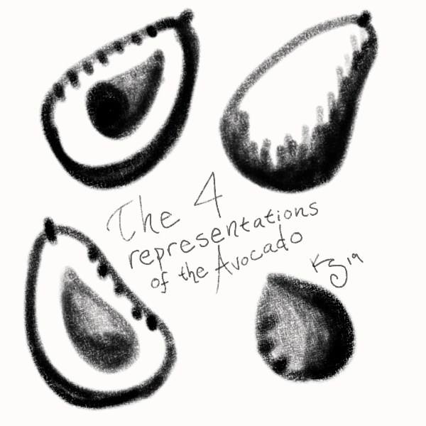

| | <h1> The Avocado, symbol of wealth and its facets </h1> |
| ------------- | :--- |

### Representation / Symbology
| There are four representations of the avocado: |
| :--- |
| - The Bisected Avocado is, as expected, an avocado cut in half, with the pit still embedded. It symbolizes wealth and generosity, for one has taken their whole avocado and gifted it- without the inconvenience of the core- to someone else.
| - The Whole Avocado is the untouched fruit with a nub of stem where it was attached to its tree. This symbolizes promise, be it wealth or good tidings or untapped talent.
| - The Gifted Half is represented as the other half of the Bisected Avocado, but without the pit. It is often used to denote a chosen one, either in skill, heritage, or luck.
| The Avocado Core is symbolized as the black pit, tear-drop shaped to one side with the point to the left, demonstrating greed, or the consumption of the avocado with only the pit remaining.

### Followers

### Practices

### Places of Worship
#### In the Home

#### The Shrine in Beacon
